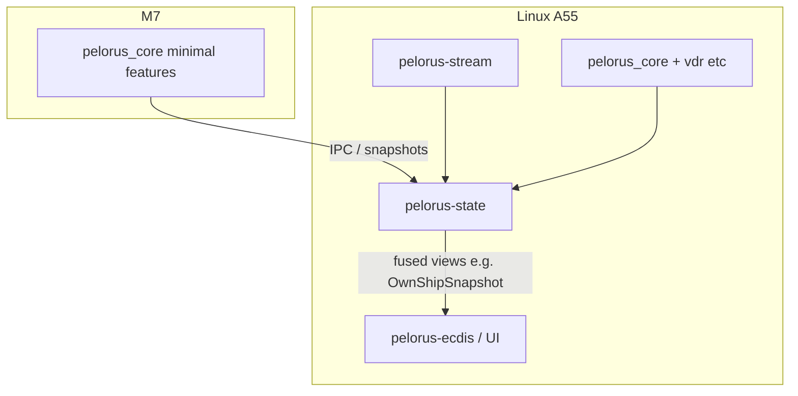

# `pelorus-core` — architecture (Cargo package)

This is the **`pelorus-core`** Rust library (**`platform/pelorus-core/`** in the repo) — Core CAN/VDR/chart-facing integration. **Stream** and **State** live in **`../pelorus-stream/`** and **`../pelorus-state/`**, not modules here.

The **normative Pelorus Core** architecture lives under **`specifications/`**; this crate implements **Rust integration** aligned with it, not the prose spec itself.

See workspace **`README.md`** at **`../README.md`** (`platform/` root).

## Scope (this crate)

- **`dcid/`** — Core-canonical [`Dcid`](src/dcid/registry.rs); map DBC lanes in `dcid::mapping`.
- **`canbus/`** — `PelorusCanDecoder` + (std-only) frame scratch log; M7 builds drop `vdr`/`std`.
- **`semantics`** (Cargo feature `semantics`) — [`correlation_for_dcid`](src/semantics.rs) → [`CorrelationSlot`](src/correlation.rs).
- **`vdr/`** — MDF4 naming + `CanDbcLogger` glue (Linux / A55).
- **`ownship/`** — `OwnShipSnapshot` for `pelorus-ecdis` via `From`.

## Stream and State (workspace siblings)

| Plane | Crate in this workspace |
|--------|--------------------------|
| **Stream** | **`pelorus-stream`** |
| **State** | **`pelorus-state`** |

**Rule:** do not add Stream codecs or State fusion engines *into this crate*; keep bounded dependencies and M7-safe feature sets.

## Dependency direction

See `PELORUS_IMPLEMENTATION_PLAN.md` at the monorepo root.
